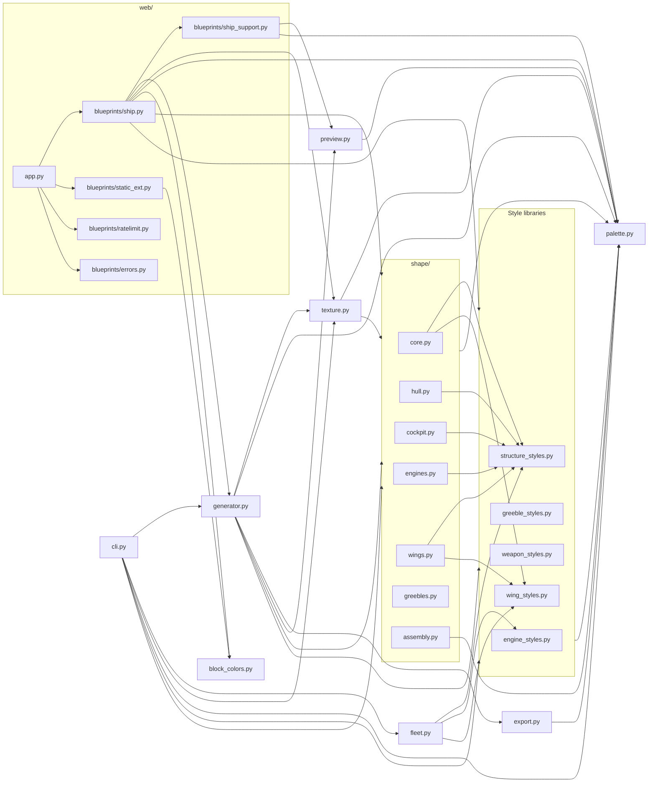

# Architecture Overview

## Overview

Spaceship Generator turns an integer seed plus a handful of tunable knobs into
a procedurally built Minecraft spaceship, serialized as a `.litematic` schematic
with an optional isometric PNG preview. The pipeline is one-way:
**seed + `ShapeParams` → coarse voxel shape → optional parts (engines,
greebles, weapons) → role refinement via `TextureParams` → palette-driven
block assignment → `.litematic` on disk (+ optional preview PNG)**. Every stage
is deterministic given its inputs, so the same seed + params reproduce the
same ship byte-for-byte.

## Module map

## Bounded contexts

- **`shape/` (voxel geometry).** Builds a `(W, H, L)` int8 grid of coarse
  roles (`HULL`, `COCKPIT_GLASS`, `ENGINE`, `WING`, `GREEBLE`). Split into
  `core` (orchestrator + `ShapeParams`/`CockpitStyle`), `hull`, `cockpit`,
  `engines`, `wings`, `greebles`, and `assembly` (X-mirror +
  connected-component floater bridging).
- **`palette` (block/role mapping).** Defines the `Role` IntEnum and the
  `Palette` dataclass that maps roles to `litemapy.BlockState`s and RGBA
  preview colors. Loads + validates YAML palettes from the repo-level
  `palettes/` directory.
- **`texture` (role painting).** Refines the coarse shape grid: interior
  fill, windows, accent stripes, panel bands, hull noise, rivets, engine
  glow, wing-tip / belly / nose-tip lights. Every pass is deterministic in
  cell coordinates.
- **`export` (.litematic serialization).** `export_litematic` pre-seeds the
  `litemapy.Region` palette in first-encounter order, then vectorizes the
  role-to-palette-index write through a LUT — bypasses litemapy's
  per-write palette scan.
- **`preview` (isometric PNG).** Matplotlib `Agg` voxel renderer with
  optional specular top-face boost, antialiased 2x downsample, and a solid
  or transparent backdrop. Exposed via `render_preview`.
- **`web/` (Flask blueprints).** `create_app()` in `app.py` composes four
  blueprints: `ship` (generate/result/preview/voxels/JSON API),
  `static_ext` (cached block-texture PNGs + `.litematic` downloads),
  `ratelimit` (per-IP fixed-window, loopback-exempt), and `errors`
  (JSON-aware 404). `ship_support` holds shared helpers and the LRU store.
- **`cli` (argparse entrypoint).** `python -m spaceship_generator` /
  `spaceship-generator`. Wires flags to `generator.generate`, supports
  `--seeds` bulk mode and `--fleet-count > 1` fleet mode, gracefully
  degrading when `weapon_styles` or `fleet` fail to import.
- **`fleet` (planning, no generation).** Pure parameter planner: given
  `FleetParams`, returns `list[GeneratedShip]` with per-ship seed, dims,
  hull/engine/wing styles, greeble density, and palette. Callers feed each
  `GeneratedShip` back through `generator.generate`.

## Key data contracts

- **`Role` (IntEnum, `palette.py`).** `EMPTY=0, HULL, HULL_DARK, WINDOW,
  ENGINE, ENGINE_GLOW, COCKPIT_GLASS, WING, GREEBLE, LIGHT, INTERIOR`. All
  non-EMPTY members are required in every palette.
- **`ShapeParams` (dataclass, `shape/core.py`).** `length, width_max,
  height_max, engine_count, wing_prob, greeble_density, cockpit_style,
  structure_style, wing_style`. Validates on construction.
- **`TextureParams` (dataclass, `texture.py`).** `window_period_cells,
  accent_stripe_period, engine_glow_depth, belly_light_period,
  nose_tip_light, hull_noise_ratio, panel_line_bands, rivet_period,
  engine_glow_ring`.
- **`Palette` (frozen dataclass, `palette.py`).** `name`, `blocks: dict[Role,
  BlockState]`, `preview_colors: dict[Role, RGBA]`. Loaded via
  `load_palette(name)` / `Palette.load(path)` / `Palette.from_dict`.
- **Style enums.** `HullStyle` (arrow, saucer, whale, dagger,
  blocky_freighter), `StructureStyle` (frigate, fighter, dreadnought,
  shuttle, hammerhead, carrier), `WingStyle` (straight, swept, delta,
  tapered, gull, split), `CockpitStyle` (bubble, pointed, integrated,
  canopy_dome, wrap_bridge, offset_turret), `EngineStyle` (single_core,
  twin_nacelle, quad_cluster, ring, ion_array), `WeaponType`
  (turret_large, missile_pod, laser_lance, point_defense, plasma_core),
  `GreebleType` (turret, dish, vent, antenna, panel_line, sensor_pod).
- **`GeneratedShip` (frozen dataclass, `fleet.py`).** `seed, dims,
  hull_style, engine_style, wing_style, greeble_density, palette`.
- **`FleetParams` (dataclass, `fleet.py`).** `count, palette, size_tier,
  style_coherence, seed`.

## Extension points

- **New palette.** Drop `<name>.yaml` under `palettes/` at the repo root
  with `name`, `blocks:` mapping every required role to a block-state
  string (`minecraft:foo` or `minecraft:foo[prop=val]`), and optional
  `preview_colors:`. `validate_palette_file` in `palette.py` is the
  reference linter; `list_palettes(include_errors=True)` surfaces it. See
  [palette_authoring.md](palette_authoring.md).
- **New style enum member.** Add the member to the enum, add a matching
  `_place_<name>` or `build_<name>` implementation, and register it in
  that module's dispatch table (`place_wings`, `build_engines`,
  `build_weapon`, `build_greeble`) or profile / scale maps (`_PROFILE_FNS`,
  `_HULL_PROFILE_FNS`, `_HULL_RX_RY_SCALES`). `--list-styles` and
  `/api/meta` enumerate the enum so new members surface automatically.
- **New cockpit variant.** Add a value to `CockpitStyle` in
  `shape/core.py`, implement `_place_<variant>` in `shape/cockpit.py`, and
  wire it into `_place_cockpit`'s dispatch. `--cockpit` / `--cockpit-style`
  and the web form's cockpit dropdown pick it up through
  `build_params_from_source`.

## Related documentation

- [faq.md](faq.md) — common questions and troubleshooting.
- [palette_authoring.md](palette_authoring.md) — palette YAML format.
- [performance.md](performance.md) — benchmark guide + vectorization notes.
- [release.md](release.md) — release checklist.
- [gallery.md](gallery.md) — curated seed + palette examples.
