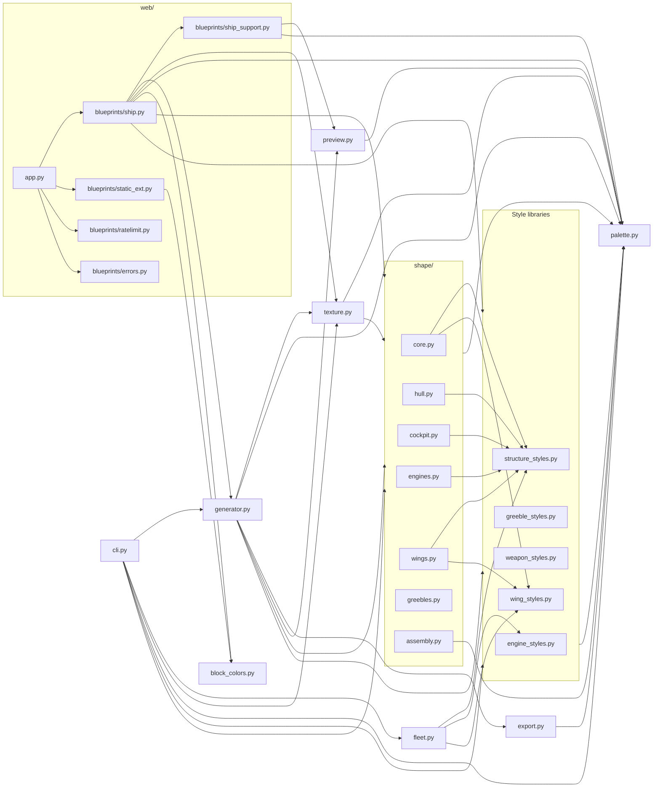

# Architecture Overview

## Overview

Spaceship Generator turns an integer seed plus a handful of tunable knobs into
a procedurally built Minecraft spaceship, serialized as a `.litematic` schematic
with an optional isometric PNG preview. The pipeline is one-way:
**seed + `ShapeParams` → coarse voxel shape → optional parts (engines,
greebles, weapons) → role refinement via `TextureParams` → palette-driven
block assignment → `.litematic` on disk (+ optional preview PNG)**. Every stage
is deterministic given its inputs, so the same seed + params reproduce the
same ship byte-for-byte.

## Module map

## Bounded contexts

- **`shape/` (voxel geometry).** Builds a `(W, H, L)` int8 grid of coarse
  roles (`HULL`, `COCKPIT_GLASS`, `ENGINE`, `WING`, `GREEBLE`). Split into
  `core` (orchestrator + `ShapeParams`/`CockpitStyle`), `hull`, `cockpit`,
  `engines`, `wings`, `greebles`, and `assembly` (X-mirror +
  connected-component floater bridging).
- **`palette` (block/role mapping).** Defines the `Role` IntEnum and the
  `Palette` dataclass that maps roles to `litemapy.BlockState`s and RGBA
  preview colors. Loads + validates YAML palettes from the repo-level
  `palettes/` directory.
- **`texture` (role painting).** Refines the coarse shape grid: interior
  fill, windows, accent stripes, panel bands, hull noise, rivets, engine
  glow, wing-tip / belly / nose-tip lights. Every pass is deterministic in
  cell coordinates.
- **`export` (.litematic serialization).** `export_litematic` pre-seeds the
  `litemapy.Region` palette in first-encounter order, then vectorizes the
  role-to-palette-index write through a LUT — bypasses litemapy's
  per-write palette scan.
- **`preview` (isometric PNG).** Matplotlib `Agg` voxel renderer with
  optional specular top-face boost, antialiased 2x downsample, and a solid
  or transparent backdrop. Exposed via `render_preview`.
- **`web/` (Flask blueprints).** `create_app()` in `app.py` composes four
  blueprints: `ship` (generate/result/preview/voxels/JSON API),
  `static_ext` (cached block-texture PNGs + `.litematic` downloads),
  `ratelimit` (per-IP fixed-window, loopback-exempt), and `errors`
  (JSON-aware 404). `ship_support` holds shared helpers and the LRU store.
- **`cli` (argparse entrypoint).** `python -m spaceship_generator` /
  `spaceship-generator`. Wires flags to `generator.generate`, supports
  `--seeds` bulk mode and `--fleet-count > 1` fleet mode, gracefully
  degrading when `weapon_styles` or `fleet` fail to import.
- **`fleet` (planning, no generation).** Pure parameter planner: given
  `FleetParams`, returns `list[GeneratedShip]` with per-ship seed, dims,
  hull/engine/wing styles, greeble density, and palette. Callers feed each
  `GeneratedShip` back through `generator.generate`.

## Key data contracts

- **`Role` (IntEnum, `palette.py`).** `EMPTY=0, HULL, HULL_DARK, WINDOW,
  ENGINE, ENGINE_GLOW, COCKPIT_GLASS, WING, GREEBLE, LIGHT, INTERIOR`. All
  non-EMPTY members are required in every palette.
- **`ShapeParams` (dataclass, `shape/core.py`).** `length, width_max,
  height_max, engine_count, wing_prob, greeble_density, cockpit_style,
  structure_style, wing_style`. Validates on construction.
- **`TextureParams` (dataclass, `texture.py`).** `window_period_cells,
  accent_stripe_period, engine_glow_depth, belly_light_period,
  nose_tip_light, hull_noise_ratio, panel_line_bands, rivet_period,
  engine_glow_ring`.
- **`Palette` (frozen dataclass, `palette.py`).** `name`, `blocks: dict[Role,
  BlockState]`, `preview_colors: dict[Role, RGBA]`. Loaded via
  `load_palette(name)` / `Palette.load(path)` / `Palette.from_dict`.
- **Style enums.** `HullStyle` (arrow, saucer, whale, dagger,
  blocky_freighter), `StructureStyle` (frigate, fighter, dreadnought,
  shuttle, hammerhead, carrier), `WingStyle` (straight, swept, delta,
  tapered, gull, split), `CockpitStyle` (bubble, pointed, integrated,
  canopy_dome, wrap_bridge, offset_turret), `EngineStyle` (single_core,
  twin_nacelle, quad_cluster, ring, ion_array), `WeaponType`
  (turret_large, missile_pod, laser_lance, point_defense, plasma_core),
  `GreebleType` (turret, dish, vent, antenna, panel_line, sensor_pod).
- **`GeneratedShip` (frozen dataclass, `fleet.py`).** `seed, dims,
  hull_style, engine_style, wing_style, greeble_density, palette`.
- **`FleetParams` (dataclass, `fleet.py`).** `count, palette, size_tier,
  style_coherence, seed`.

## Extension points

- **New palette.** Drop `<name>.yaml` under `palettes/` at the repo root
  with `name`, `blocks:` mapping every required role to a block-state
  string (`minecraft:foo` or `minecraft:foo[prop=val]`), and optional
  `preview_colors:`. `validate_palette_file` in `palette.py` is the
  reference linter; `list_palettes(include_errors=True)` surfaces it. See
  [palette_authoring.md](palette_authoring.md).
- **New style enum member.** Add the member to the enum, add a matching
  `_place_<name>` or `build_<name>` implementation, and register it in
  that module's dispatch table (`place_wings`, `build_engines`,
  `build_weapon`, `build_greeble`) or profile / scale maps (`_PROFILE_FNS`,
  `_HULL_PROFILE_FNS`, `_HULL_RX_RY_SCALES`). `--list-styles` and
  `/api/meta` enumerate the enum so new members surface automatically.
- **New cockpit variant.** Add a value to `CockpitStyle` in
  `shape/core.py`, implement `_place_<variant>` in `shape/cockpit.py`, and
  wire it into `_place_cockpit`'s dispatch. `--cockpit` / `--cockpit-style`
  and the web form's cockpit dropdown pick it up through
  `build_params_from_source`.

## Shape pipeline

The shape pipeline turns a deterministic integer seed plus a handful of style
enums (`StructureStyle`, `HullStyle`, `WingStyle`, `CockpitStyle`,
`EngineStyle`) into a `(W, H, L)` int8 voxel grid of coarse `Role` codes.
That grid is the single hand-off contract for everything downstream:
`texture.py` refines it into fine roles (windows, glow, lights, panels) and
`export.py` serializes the result to `.litematic`. The pipeline is one-way and
fully deterministic — same seed + same `ShapeParams` + same `hull_style`
produce the same grid byte-for-byte.

The grid is indexed `grid[x, y, z]`: `x` is width (the bilateral-symmetry
axis), `y` is Minecraft Y-up height, `z` is length with `z = 0` at the rear
(engine end) and `z = L - 1` at the nose. Only coarse roles (`HULL`,
`COCKPIT_GLASS`, `ENGINE`, `WING`, `GREEBLE`) are written here.

### Build order

```mermaid
flowchart LR
  seed([seed + ShapeParams + hull_style])
  hull[hull.py<br/>_place_hull<br/>or apply_hull_style]
  cockpit[cockpit.py<br/>_place_cockpit]
  engines[engines.py<br/>_place_engines]
  wings[wings.py<br/>_place_wings<br/>RNG-gated]
  greebles[greebles.py<br/>_place_greebles]
  mirror1[assembly.py<br/>_enforce_x_symmetry]
  connect[assembly.py<br/>_connect_floaters]
  mirror2[assembly.py<br/>_enforce_x_symmetry]
  grid([int8 grid<br/>W,H,L of Role])

  seed --> hull --> cockpit --> engines --> wings --> greebles
  greebles --> mirror1 --> connect --> mirror2 --> grid
  grid -. consumed by .-> texture[texture.py]
  grid -. consumed by .-> export[export.py]
```

The exact order is set by `generate_shape` in `shape/core.py`:
hull, cockpit, engines, then `_place_wings` if `rng.random() <
wing_prob_override(structure_style, params.wing_prob)`, then greebles, then
mirror, connect-floaters, mirror again. The mirror runs twice on purpose —
`_connect_floaters` may draw bridge segments asymmetrically, so the second
mirror pass restamps bilateral symmetry as the final state.

### `core.py`

Defines the orchestrator and the shape-side data contracts. Exports
`ShapeParams` (length / width_max / height_max / engine_count / wing_prob /
greeble_density / cockpit_style / structure_style / wing_style, validated in
`__post_init__`), the `CockpitStyle` `StrEnum` (`bubble`, `pointed`,
`integrated`, `canopy_dome`, `wrap_bridge`, `offset_turret`), the legacy
`_body_profile(t)` taper, and the top-level `generate_shape(seed, params,
*, hull_style=None) -> np.ndarray`. `generate_shape` constructs the
`np.random.default_rng(seed)`, allocates the empty `(W, H, L)` int8 grid,
dispatches each placement stage in order, and applies the symmetry +
floater-bridging finalization. When `hull_style` is `None` it calls
`_place_hull`; when set, it stamps the base hull via
`apply_hull_style(grid, hull_style)` from `structure_styles` instead, then
runs the rest of the pipeline unchanged.

### `hull.py`

Single function: `_place_hull(grid, rng, params)`. Inputs the empty grid,
the seeded RNG (used only for a small `0.9 + rng.random() * 0.1` thickness
jitter), and `ShapeParams`. Output: the grid with `Role.HULL` voxels filling
a tapered ellipsoid-of-revolution along Z. The taper profile and the X / Y
radius scales are picked per `params.structure_style` via
`profile_fn(structure_style)` and `hull_rx_ry_scale(structure_style)` from
`structure_styles`; `FRIGATE` reproduces the legacy profile byte-for-byte.
This stage is the membrane of the ship — every later stage either modifies
hull voxels (cockpit, integrated/wrap variants) or attaches new voxels
adjacent to it.

### `assembly.py`

Post-placement passes that finalize the grid into a connected, X-symmetric
solid. `_enforce_x_symmetry(grid)` copies the left half onto the right half
across `x = W/2`. `_label_components(grid)` returns a `(labels,
n_components)` tuple where each filled voxel carries its 6-connected
component id (`-1` = empty); the implementation is fully numpy-vectorized
(provisional `cumsum` ids → union-find pair propagation with `np.minimum.at`
and path-halving → dense renumber in scan order) and is the basis of the
`~91%` speedup recorded in the changelog. `_connect_floaters(grid)` finds
the largest component, picks the lexicographically-first voxel of each
remaining floater, finds its closest main-body voxel by Manhattan distance,
and stamps a 6-connected `Role.HULL` line via `_draw_line_hull(grid, a, b)`.
Net effect: engines/wings that the tapered hull left disconnected get
bridged back to the main mass before the final mirror pass.

### `cockpit.py`

`_place_cockpit(grid, rng, params)` dispatches on
`default_cockpit_for(structure_style, cockpit_style)` from `structure_styles`
(structure style can override the requested cockpit). Six concrete
placers, each writing `Role.COCKPIT_GLASS` (and occasionally framing
`Role.HULL`) on the forward upper hull: `_place_cockpit_bubble` (small
ellipsoidal bulge), `_place_cockpit_pointed` (tapered cone canopy
narrowing to the nose), `_place_cockpit_integrated` (flat strip — converts
the topmost hull voxels into glass without growing the silhouette),
`_place_canopy_dome` (low half-ellipsoid dome with a one-row hull collar),
`_place_wrap_bridge` (panoramic glass band one row above the hull top with a
hull roof on its edges), and `_place_offset_turret` (asymmetric raised
turret — deliberately breaks X-symmetry, restored later by the assembly
mirror). RNG is unused here; cockpit shape is purely a function of
`ShapeParams` and grid dimensions.

### `wings.py`

Single function: `_place_wings(grid, rng, params)`. This module owns only
the placement-box math; the actual cell-writing pattern lives in
`spaceship_generator.wing_styles.place_wings`. Reads
`wing_size_scale(params.structure_style)` to scale span / thickness /
length, computes `cy` from grid height, draws `cz` from a small RNG
integer offset around `L // 3`, clamps the wing length so it fits the grid,
and calls `wing_styles.place_wings(grid, params.wing_style, span=...,
thickness=..., length=..., cy=..., cz=..., y_lo=..., y_hi=...)` to write
the left wing as `Role.WING`. The right wing is produced later by
`_enforce_x_symmetry`. Whether this stage runs at all is decided in
`generate_shape` against `wing_prob_override(structure_style, wing_prob)`.

### `engines.py`

`_place_engines(grid, rng, params)` and the helper `_engine_x_positions(n,
width, radius)`. Reads
`engine_count_override(structure_style, params.engine_count)` for `n` (zero
short-circuits the stage), then computes `engine_length = max(2, L // 8)`,
a base radius from `min(W, H) // 10`, and the final radius from
`engine_radius_scale(structure_style)`. `_engine_x_positions` lays out
`n` symmetric X positions clamped into `[radius, W - 1 - radius]` (and
collapses every engine to the ship center if the grid is too narrow to fit
`n` distinct positions). Each position stamps a circular cross-section of
`Role.ENGINE` voxels from `z = 0` for `engine_length` steps along Z. RNG is
not consumed — engine geometry is fully deterministic in style + dimensions.

### `greebles.py`

`_place_greebles(grid, rng, params)` and the helper `_surface_mask(grid)`.
Skips the stage when `params.greeble_density <= 0`. `_surface_mask` returns
a boolean grid of "filled voxels with at least one empty 6-neighbor"
(out-of-bounds counts as empty so the outer shell qualifies). The placer
shuffles those surface coordinates with `rng.permutation`, walks the first
`int(len(coords) * greeble_density)` of them, and on cells whose role is
`HULL` or `WING` it picks the first 6-direction neighbor (preferring up,
then sideways, then forward / back) that is `Role.EMPTY` and writes
`Role.GREEBLE` there. Greebles therefore protrude *outside* existing
geometry and never overwrite hull/wing/engine/cockpit voxels.

### `assembly.py` (final pass)

After greebles, `generate_shape` runs `_enforce_x_symmetry` →
`_connect_floaters` → `_enforce_x_symmetry`. The first mirror discards any
asymmetry introduced by `_place_offset_turret` and the random
greeble/wing pickers. `_connect_floaters` then bridges any island that the
tapered hull left disconnected (engines on a narrow rear, wings clipped by
the taper). The second mirror restamps bilateral symmetry over those
bridge lines so the returned grid is guaranteed mirror-symmetric in X.

## Related documentation

- [faq.md](faq.md) — common questions and troubleshooting.
- [palette_authoring.md](palette_authoring.md) — palette YAML format.
- [performance.md](performance.md) — benchmark guide + vectorization notes.
- [release.md](release.md) — release checklist.
- [gallery.md](gallery.md) — curated seed + palette examples.
