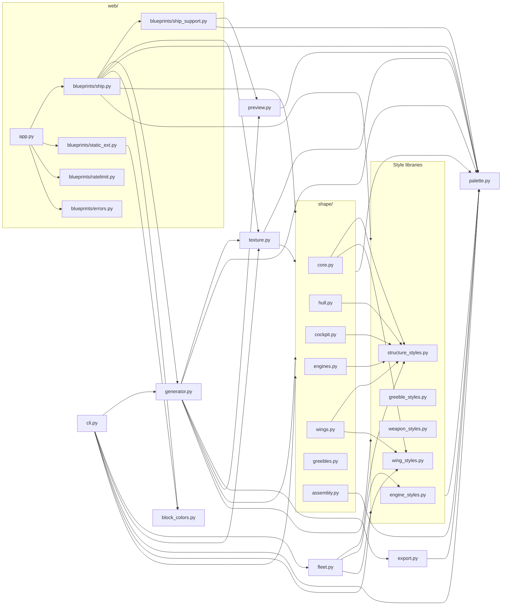
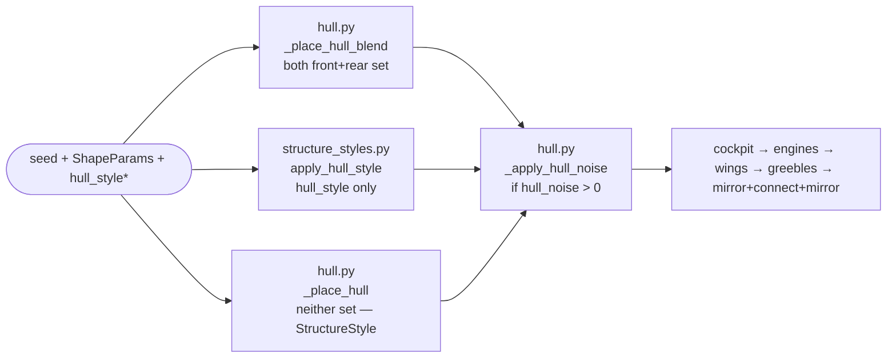
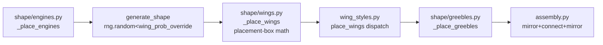
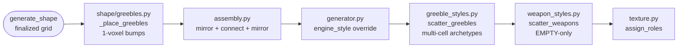
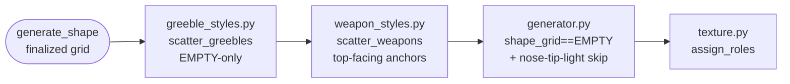
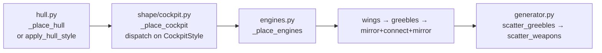
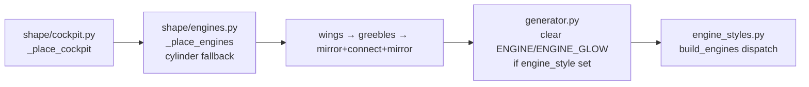
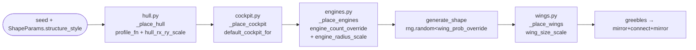
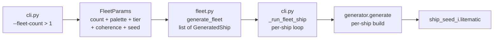

# Architecture Overview

## Overview

Spaceship Generator turns an integer seed plus a handful of tunable knobs into
a procedurally built Minecraft spaceship, serialized as a `.litematic` schematic
with an optional isometric PNG preview. The pipeline is one-way:
**seed + `ShapeParams` → coarse voxel shape → optional parts (engines,
greebles, weapons) → role refinement via `TextureParams` → palette-driven
block assignment → `.litematic` on disk (+ optional preview PNG)**. Every stage
is deterministic given its inputs, so the same seed + params reproduce the
same ship byte-for-byte.

## Module map

```mermaid
flowchart LR
  cli[cli.py]
  gen[generator.py]
  fleet[fleet.py]
  preview[preview.py]
  export[export.py]
  texture[texture.py]
  palette[palette.py]
  block_colors[block_colors.py]

  subgraph style_libs[Style libraries]
    engine_styles[engine_styles.py]
    greeble_styles[greeble_styles.py]
    weapon_styles[weapon_styles.py]
    structure_styles[structure_styles.py]
    wing_styles[wing_styles.py]
  end

  subgraph shape_pkg[shape/]
    shape_core[core.py]
    shape_hull[hull.py]
    shape_cockpit[cockpit.py]
    shape_engines[engines.py]
    shape_wings[wings.py]
    shape_greebles[greebles.py]
    shape_assembly[assembly.py]
  end

  subgraph web_pkg[web/]
    web_app[app.py]
    bp_ship[blueprints/ship.py]
    bp_support[blueprints/ship_support.py]
    bp_static[blueprints/static_ext.py]
    bp_rate[blueprints/ratelimit.py]
    bp_errors[blueprints/errors.py]
  end

  cli --> gen
  cli --> fleet
  cli --> style_libs
  cli --> shape_pkg
  cli --> texture
  cli --> palette

  gen --> shape_pkg
  gen --> style_libs
  gen --> texture
  gen --> palette
  gen --> export
  gen --> preview

  shape_core --> structure_styles
  shape_core --> wing_styles
  shape_hull --> structure_styles
  shape_cockpit --> structure_styles
  shape_engines --> structure_styles
  shape_wings --> structure_styles
  shape_wings --> wing_styles
  shape_pkg --> palette
  shape_assembly --> palette

  texture --> palette
  texture --> shape_pkg
  export --> palette
  preview --> palette
  style_libs --> palette
  fleet --> structure_styles
  fleet --> engine_styles
  fleet --> wing_styles

  web_app --> bp_ship
  web_app --> bp_static
  web_app --> bp_rate
  web_app --> bp_errors
  bp_ship --> bp_support
  bp_ship --> gen
  bp_ship --> shape_pkg
  bp_ship --> texture
  bp_ship --> palette
  bp_ship --> style_libs
  bp_ship --> block_colors
  bp_support --> preview
  bp_support --> palette
  bp_static --> block_colors
```

## Bounded contexts

- **`shape/` (voxel geometry).** Builds a `(W, H, L)` int8 grid of coarse
  roles (`HULL`, `COCKPIT_GLASS`, `ENGINE`, `WING`, `GREEBLE`). Split into
  `core` (orchestrator + `ShapeParams`/`CockpitStyle`), `hull`, `cockpit`,
  `engines`, `wings`, `greebles`, and `assembly` (X-mirror +
  connected-component floater bridging).
- **`palette` (block/role mapping).** Defines the `Role` IntEnum and the
  `Palette` dataclass that maps roles to `litemapy.BlockState`s and RGBA
  preview colors. Loads + validates YAML palettes from the repo-level
  `palettes/` directory.
- **`texture` (role painting).** Refines the coarse shape grid: interior
  fill, windows, accent stripes, panel bands, hull noise, rivets, engine
  glow, wing-tip / belly / nose-tip lights. Every pass is deterministic in
  cell coordinates.
- **`export` (.litematic serialization).** `export_litematic` pre-seeds the
  `litemapy.Region` palette in first-encounter order, then vectorizes the
  role-to-palette-index write through a LUT — bypasses litemapy's
  per-write palette scan.
- **`preview` (isometric PNG).** Matplotlib `Agg` voxel renderer with
  optional specular top-face boost, antialiased 2x downsample, and a solid
  or transparent backdrop. Exposed via `render_preview`.
- **`web/` (Flask blueprints).** `create_app()` in `app.py` composes four
  blueprints: `ship` (generate/result/preview/voxels/JSON API),
  `static_ext` (cached block-texture PNGs + `.litematic` downloads),
  `ratelimit` (per-IP fixed-window, loopback-exempt), and `errors`
  (JSON-aware 404). `ship_support` holds shared helpers and the LRU store.
- **`cli` (argparse entrypoint).** `python -m spaceship_generator` /
  `spaceship-generator`. Wires flags to `generator.generate`, supports
  `--seeds` bulk mode and `--fleet-count > 1` fleet mode, gracefully
  degrading when `weapon_styles` or `fleet` fail to import.
- **`fleet` (planning, no generation).** Pure parameter planner: given
  `FleetParams`, returns `list[GeneratedShip]` with per-ship seed, dims,
  hull/engine/wing styles, greeble density, and palette. Callers feed each
  `GeneratedShip` back through `generator.generate`.

## Key data contracts

- **`Role` (IntEnum, `palette.py`).** `EMPTY=0, HULL, HULL_DARK, WINDOW,
  ENGINE, ENGINE_GLOW, COCKPIT_GLASS, WING, GREEBLE, LIGHT, INTERIOR`. All
  non-EMPTY members are required in every palette.
- **`ShapeParams` (dataclass, `shape/core.py`).** `length, width_max,
  height_max, engine_count, wing_prob, greeble_density, cockpit_style,
  structure_style, wing_style`. Validates on construction.
- **`TextureParams` (dataclass, `texture.py`).** `window_period_cells,
  accent_stripe_period, engine_glow_depth, belly_light_period,
  nose_tip_light, hull_noise_ratio, panel_line_bands, rivet_period,
  engine_glow_ring`.
- **`Palette` (frozen dataclass, `palette.py`).** `name`, `blocks: dict[Role,
  BlockState]`, `preview_colors: dict[Role, RGBA]`. Loaded via
  `load_palette(name)` / `Palette.load(path)` / `Palette.from_dict`.
- **Style enums.** `HullStyle` (arrow, saucer, whale, dagger,
  blocky_freighter), `StructureStyle` (frigate, fighter, dreadnought,
  shuttle, hammerhead, carrier), `WingStyle` (straight, swept, delta,
  tapered, gull, split), `CockpitStyle` (bubble, pointed, integrated,
  canopy_dome, wrap_bridge, offset_turret), `EngineStyle` (single_core,
  twin_nacelle, quad_cluster, ring, ion_array), `WeaponType`
  (turret_large, missile_pod, laser_lance, point_defense, plasma_core),
  `GreebleType` (turret, dish, vent, antenna, panel_line, sensor_pod).
- **`GeneratedShip` (frozen dataclass, `fleet.py`).** `seed, dims,
  hull_style, engine_style, wing_style, greeble_density, palette`.
- **`FleetParams` (dataclass, `fleet.py`).** `count, palette, size_tier,
  style_coherence, seed`.

## Extension points

- **New palette.** Drop `<name>.yaml` under `palettes/` at the repo root
  with `name`, `blocks:` mapping every required role to a block-state
  string (`minecraft:foo` or `minecraft:foo[prop=val]`), and optional
  `preview_colors:`. `validate_palette_file` in `palette.py` is the
  reference linter; `list_palettes(include_errors=True)` surfaces it. See
  [palette_authoring.md](palette_authoring.md).
- **New style enum member.** Add the member to the enum, add a matching
  `_place_<name>` or `build_<name>` implementation, and register it in
  that module's dispatch table (`place_wings`, `build_engines`,
  `build_weapon`, `build_greeble`) or profile / scale maps (`_PROFILE_FNS`,
  `_HULL_PROFILE_FNS`, `_HULL_RX_RY_SCALES`). `--list-styles` and
  `/api/meta` enumerate the enum so new members surface automatically.
- **New cockpit variant.** Add a value to `CockpitStyle` in
  `shape/core.py`, implement `_place_<variant>` in `shape/cockpit.py`, and
  wire it into `_place_cockpit`'s dispatch. `--cockpit` / `--cockpit-style`
  and the web form's cockpit dropdown pick it up through
  `build_params_from_source`.

## Per-component pipelines

The ship-build pipeline is decomposed into per-component sub-pipelines documented below. Jump to a specific one:

- [Shape pipeline](#shape-pipeline)
- [Hull pipeline](#hull-pipeline)
- [Wing pipeline](#wing-pipeline)
- [Greeble pipeline](#greeble-pipeline)
- [Weapon pipeline](#weapon-pipeline)
- [Cockpit pipeline](#cockpit-pipeline)
- [Engine pipeline](#engine-pipeline)
- [Structure pipeline](#structure-pipeline)

## Shape pipeline

The shape pipeline turns a deterministic integer seed plus a handful of style
enums (`StructureStyle`, `HullStyle`, `WingStyle`, `CockpitStyle`,
`EngineStyle`) into a `(W, H, L)` int8 voxel grid of coarse `Role` codes.
That grid is the single hand-off contract for everything downstream:
`texture.py` refines it into fine roles (windows, glow, lights, panels) and
`export.py` serializes the result to `.litematic`. The pipeline is one-way and
fully deterministic — same seed + same `ShapeParams` + same `hull_style`
produce the same grid byte-for-byte.

The grid is indexed `grid[x, y, z]`: `x` is width (the bilateral-symmetry
axis), `y` is Minecraft Y-up height, `z` is length with `z = 0` at the rear
(engine end) and `z = L - 1` at the nose. Only coarse roles (`HULL`,
`COCKPIT_GLASS`, `ENGINE`, `WING`, `GREEBLE`) are written here.

### Build order

```mermaid
flowchart LR
  seed([seed + ShapeParams + hull_style])
  hull[hull.py<br/>_place_hull<br/>or apply_hull_style]
  cockpit[cockpit.py<br/>_place_cockpit]
  engines[engines.py<br/>_place_engines]
  wings[wings.py<br/>_place_wings<br/>RNG-gated]
  greebles[greebles.py<br/>_place_greebles]
  mirror1[assembly.py<br/>_enforce_x_symmetry]
  connect[assembly.py<br/>_connect_floaters]
  mirror2[assembly.py<br/>_enforce_x_symmetry]
  grid([int8 grid<br/>W,H,L of Role])

  seed --> hull --> cockpit --> engines --> wings --> greebles
  greebles --> mirror1 --> connect --> mirror2 --> grid
  grid -. consumed by .-> texture[texture.py]
  grid -. consumed by .-> export[export.py]
```

The exact order is set by `generate_shape` in `shape/core.py`:
hull, cockpit, engines, then `_place_wings` if `rng.random() <
wing_prob_override(structure_style, params.wing_prob)`, then greebles, then
mirror, connect-floaters, mirror again. The mirror runs twice on purpose —
`_connect_floaters` may draw bridge segments asymmetrically, so the second
mirror pass restamps bilateral symmetry as the final state.

### `core.py`

Defines the orchestrator and the shape-side data contracts. Exports
`ShapeParams` (length / width_max / height_max / engine_count / wing_prob /
greeble_density / cockpit_style / structure_style / wing_style, validated in
`__post_init__`), the `CockpitStyle` `StrEnum` (`bubble`, `pointed`,
`integrated`, `canopy_dome`, `wrap_bridge`, `offset_turret`), the legacy
`_body_profile(t)` taper, and the top-level `generate_shape(seed, params,
*, hull_style=None) -> np.ndarray`. `generate_shape` constructs the
`np.random.default_rng(seed)`, allocates the empty `(W, H, L)` int8 grid,
dispatches each placement stage in order, and applies the symmetry +
floater-bridging finalization. When `hull_style` is `None` it calls
`_place_hull`; when set, it stamps the base hull via
`apply_hull_style(grid, hull_style)` from `structure_styles` instead, then
runs the rest of the pipeline unchanged.

### `hull.py`

Single function: `_place_hull(grid, rng, params)`. Inputs the empty grid,
the seeded RNG (used only for a small `0.9 + rng.random() * 0.1` thickness
jitter), and `ShapeParams`. Output: the grid with `Role.HULL` voxels filling
a tapered ellipsoid-of-revolution along Z. The taper profile and the X / Y
radius scales are picked per `params.structure_style` via
`profile_fn(structure_style)` and `hull_rx_ry_scale(structure_style)` from
`structure_styles`; `FRIGATE` reproduces the legacy profile byte-for-byte.
This stage is the membrane of the ship — every later stage either modifies
hull voxels (cockpit, integrated/wrap variants) or attaches new voxels
adjacent to it.

### `assembly.py`

Post-placement passes that finalize the grid into a connected, X-symmetric
solid. `_enforce_x_symmetry(grid)` copies the left half onto the right half
across `x = W/2`. `_label_components(grid)` returns a `(labels,
n_components)` tuple where each filled voxel carries its 6-connected
component id (`-1` = empty); the implementation is fully numpy-vectorized
(provisional `cumsum` ids → union-find pair propagation with `np.minimum.at`
and path-halving → dense renumber in scan order) and is the basis of the
`~91%` speedup recorded in the changelog. `_connect_floaters(grid)` finds
the largest component, picks the lexicographically-first voxel of each
remaining floater, finds its closest main-body voxel by Manhattan distance,
and stamps a 6-connected `Role.HULL` line via `_draw_line_hull(grid, a, b)`.
Net effect: engines/wings that the tapered hull left disconnected get
bridged back to the main mass before the final mirror pass.

### `cockpit.py`

`_place_cockpit(grid, rng, params)` dispatches on
`default_cockpit_for(structure_style, cockpit_style)` from `structure_styles`
(structure style can override the requested cockpit). Six concrete
placers, each writing `Role.COCKPIT_GLASS` (and occasionally framing
`Role.HULL`) on the forward upper hull: `_place_cockpit_bubble` (small
ellipsoidal bulge), `_place_cockpit_pointed` (tapered cone canopy
narrowing to the nose), `_place_cockpit_integrated` (flat strip — converts
the topmost hull voxels into glass without growing the silhouette),
`_place_canopy_dome` (low half-ellipsoid dome with a one-row hull collar),
`_place_wrap_bridge` (panoramic glass band one row above the hull top with a
hull roof on its edges), and `_place_offset_turret` (asymmetric raised
turret — deliberately breaks X-symmetry, restored later by the assembly
mirror). RNG is unused here; cockpit shape is purely a function of
`ShapeParams` and grid dimensions.

### `wings.py`

Single function: `_place_wings(grid, rng, params)`. This module owns only
the placement-box math; the actual cell-writing pattern lives in
`spaceship_generator.wing_styles.place_wings`. Reads
`wing_size_scale(params.structure_style)` to scale span / thickness /
length, computes `cy` from grid height, draws `cz` from a small RNG
integer offset around `L // 3`, clamps the wing length so it fits the grid,
and calls `wing_styles.place_wings(grid, params.wing_style, span=...,
thickness=..., length=..., cy=..., cz=..., y_lo=..., y_hi=...)` to write
the left wing as `Role.WING`. The right wing is produced later by
`_enforce_x_symmetry`. Whether this stage runs at all is decided in
`generate_shape` against `wing_prob_override(structure_style, wing_prob)`.

### `engines.py`

`_place_engines(grid, rng, params)` and the helper `_engine_x_positions(n,
width, radius)`. Reads
`engine_count_override(structure_style, params.engine_count)` for `n` (zero
short-circuits the stage), then computes `engine_length = max(2, L // 8)`,
a base radius from `min(W, H) // 10`, and the final radius from
`engine_radius_scale(structure_style)`. `_engine_x_positions` lays out
`n` symmetric X positions clamped into `[radius, W - 1 - radius]` (and
collapses every engine to the ship center if the grid is too narrow to fit
`n` distinct positions). Each position stamps a circular cross-section of
`Role.ENGINE` voxels from `z = 0` for `engine_length` steps along Z. RNG is
not consumed — engine geometry is fully deterministic in style + dimensions.

### `greebles.py`

`_place_greebles(grid, rng, params)` and the helper `_surface_mask(grid)`.
Skips the stage when `params.greeble_density <= 0`. `_surface_mask` returns
a boolean grid of "filled voxels with at least one empty 6-neighbor"
(out-of-bounds counts as empty so the outer shell qualifies). The placer
shuffles those surface coordinates with `rng.permutation`, walks the first
`int(len(coords) * greeble_density)` of them, and on cells whose role is
`HULL` or `WING` it picks the first 6-direction neighbor (preferring up,
then sideways, then forward / back) that is `Role.EMPTY` and writes
`Role.GREEBLE` there. Greebles therefore protrude *outside* existing
geometry and never overwrite hull/wing/engine/cockpit voxels.

### `assembly.py` (final pass)

After greebles, `generate_shape` runs `_enforce_x_symmetry` →
`_connect_floaters` → `_enforce_x_symmetry`. The first mirror discards any
asymmetry introduced by `_place_offset_turret` and the random
greeble/wing pickers. `_connect_floaters` then bridges any island that the
tapered hull left disconnected (engines on a narrow rear, wings clipped by
the taper). The second mirror restamps bilateral symmetry over those
bridge lines so the returned grid is guaranteed mirror-symmetric in X.

## Hull pipeline

The hull is the membrane every other part attaches to: stamped first
inside `generate_shape`, every later stage (cockpit, engines, wings,
greebles, weapons) modifies hull voxels or anchors voxels adjacent to
them. Three placers are available; the generator picks one per call
based on which `hull_style*` kwargs are set.

### Build order

```mermaid
flowchart LR
  seed([seed + ShapeParams + hull_style*])
  blend[hull.py<br/>_place_hull_blend<br/>both front+rear set]
  single[structure_styles.py<br/>apply_hull_style<br/>hull_style only]
  legacy[hull.py<br/>_place_hull<br/>neither set — StructureStyle]
  noise[hull.py<br/>_apply_hull_noise<br/>if hull_noise > 0]
  rest[cockpit → engines → wings → greebles → mirror+connect+mirror]

  seed --> blend --> noise
  seed --> single --> noise
  seed --> legacy --> noise
  noise --> rest
```

Dispatch lives in `generate_shape` (`shape/core.py`): when both
`hull_style_front` and `hull_style_rear` are set, `_place_hull_blend`
wins; else when `hull_style` is set, `apply_hull_style(grid, hull_style)`
runs; else the legacy `_place_hull` picks profile + rx/ry from
`params.structure_style` via `profile_fn` / `hull_rx_ry_scale`. All
three paths write only `Role.HULL`; the optional `_apply_hull_noise`
post-pass runs next (no-op when `hull_noise == 0`).

### `HullStyle` (in `structure_styles.py`)

`HullStyle` is a `StrEnum` with 10 members today (`ARROW`, `SAUCER`,
`WHALE`, `DAGGER`, `BLOCKY_FREIGHTER`, `ORGANIC_BIO`,
`HEXAGONAL_LATTICE`, `ASYMMETRIC_SCAVENGER`, `MODULAR_BLOCK`,
`SLEEK_RACING`). It lives in `structure_styles.py` rather than a
free-standing `hull_styles.py` because the dispatch tables
(`_HULL_PROFILE_FNS`, `_HULL_RX_RY_SCALES`) sit beside the
`StructureStyle` maps and share helpers (`hull_profile_fn`,
`hull_style_rx_ry`, `blended_hull_radii`).

### `shape/hull.py`

Three entry points: `_place_hull(grid, rng, params)` — legacy taper
from `StructureStyle` (one `rng.random()` thickness-jitter, the only
RNG draw a hull placer makes); `_place_hull_blend(grid, rng, front,
rear, *, midband=0.25)` — Z-axis cosine-weighted blend of two
`HullStyle` profiles via `blended_hull_radii`, also consuming one
thickness-jitter so the seed contract stays intact; and
`_apply_hull_noise(grid, rng, params)` — optional hash-noise post-pass
that erodes/grows the membrane, bounded to ±2 cells. The RNG-free
single-style entry `apply_hull_style(grid, style)` lives in `structure_styles.py`.

### `hull_style` and `hull_style_*` kwargs

Unlike `cockpit_style` / `wing_style` / `structure_style`, `hull_style`
is **not** a field on `ShapeParams` — it is a keyword-only argument on
`generate_shape(seed, params, *, hull_style=None, hull_style_front=None,
hull_style_rear=None, hull_blend_midband=0.25)` and on
`generator.generate(...)`, which forwards them through. `None` defaults
preserve legacy behavior byte-for-byte. CLI plumbing: `--hull-style`,
`--hull-style-front`, `--hull-style-rear`; the web layer reads
`hull_style` via `_parse_optional_enum`. `presets.py` pins a `HullStyle`.

### Relationship to symmetry

All three hull placers stamp voxels via the centred ellipsoid test
`((x-cx)/rx)**2 + ((y-cy)/ry)**2 <= 1.0` with `cx = (W-1)/2`, so the
membrane is bilaterally symmetric in X by construction. The final
`_enforce_x_symmetry` → `_connect_floaters` → `_enforce_x_symmetry`
restamps symmetry against asymmetry from `_place_offset_turret`, the
greeble/wing pickers, and `_apply_hull_noise`.

### Cross-references

- CLI ([docs/cli.md](cli.md)): `--hull-style`, `--list-shape-styles`, `--list-shape-styles-json`. Web API ([docs/web_ui.md](web_ui.md)): `GET /api/hull-styles`, `GET /api/shape-styles`.

## Wing pipeline

Wings are the bilateral aerodynamic slabs that give a ship its planform —
straight, swept, delta, tapered, gull, or split-biplane. Unlike greebles
and weapons, wings are not a scatter pass: at most one left-side wing is
stamped per ship inside the shape build between engines and greebles,
and the right wing is produced later by the assembly mirror.

### Build order

```mermaid
flowchart LR
  engines[shape/engines.py<br/>_place_engines]
  gate[generate_shape<br/>rng.random&lt;wing_prob_override]
  wings[shape/wings.py<br/>_place_wings<br/>placement-box math]
  styles[wing_styles.py<br/>place_wings dispatch]
  greebles[shape/greebles.py<br/>_place_greebles]
  mirror[assembly.py<br/>mirror+connect+mirror]

  engines --> gate --> wings --> styles --> greebles --> mirror
```

Whether the stage runs at all is decided in `generate_shape`
(`shape/core.py`) against `rng.random() <
wing_prob_override(structure_style, params.wing_prob)`, so some
structure styles can suppress wings entirely. When it runs, only the
left half (`x < W/2`) is written; the right wing is produced by the
final `_enforce_x_symmetry` pass.

### `WingStyle` (in `wing_styles.py`)

`WingStyle` is a `StrEnum` with 6 members today (`STRAIGHT`, `SWEPT`,
`DELTA`, `TAPERED`, `GULL`, `SPLIT`). `STRAIGHT` is the byte-compat
legacy default — `_place_straight` MUST reproduce the pre-WingStyle
placement byte-for-byte; every historical seed depends on it.

### `wing_styles.py`

Top-level dispatcher `place_wings(grid, wing_style, *, span, thickness,
length, cy, cz, y_lo, y_hi)` routes to one of six private placers, each
writing only `Role.WING` on the left half: `_place_straight`
(rectangular slab), `_place_swept` (parallelogram, tip shifted rearward
~60% of span), `_place_delta` (triangle in plan view, root `span`
shrinking to 1 at the nose-side tip), `_place_tapered` (straight
leading edge, chord shrinks to ~40% at tip), `_place_gull` (inner half
flat, outer half rises one Y per X past the knee), and `_place_split`
(two thinner wings stacked with a vertical gap — biplane-style). All
styles clip to grid bounds, so pathologically small inputs cannot write
out-of-bounds.

### `shape/wings.py`

Single function `_place_wings(grid, rng, params)` owns only the
placement-box math — the cell-writing pattern lives in
`wing_styles.place_wings`. Reads `wing_size_scale(params.structure_style)`
from `structure_styles.py` to scale span / thickness / length, computes
`cy` from grid height, draws `cz` from a small `rng.integers` offset
around `L // 3`, clamps wing length to fit the grid, then forwards
`params.wing_style` and the computed box to `wing_styles.place_wings`.

### `wing_style` and `ShapeParams.wing_style`

`wing_style` is a `WingStyle` field on `ShapeParams` (default
`WingStyle.STRAIGHT`, validated in `__post_init__`) and the sole input
that picks which placer runs — `place_wings` reads it directly. The
CLI plumbs it through `--wing-style` (`WingStyle(args.wing_style)` in
`build_params_from_source`); the web layer reads `wing_style` from the
form/JSON field. `presets.py` pins a `WingStyle` per preset; `fleet.py`
plans a per-ship `wing_style` the caller hands back to `generator.generate`.

### Relationship to symmetry

Every per-style placer writes only `x < W/2`. The right wing is
produced by the post-greeble `_enforce_x_symmetry` (copies left over
`x = W/2`). `_connect_floaters` may bridge a wing tip the tapered hull
left disconnected; the second mirror restamps symmetry over the bridge.

### Cross-references

- CLI ([docs/cli.md](cli.md)): `--wing-style`, `--list-shape-styles`, `--list-shape-styles-json`. Web API ([docs/web_ui.md](web_ui.md)): `GET /api/wing-styles`, `GET /api/shape-styles`.

## Greeble pipeline

Greebles are the small surface details that sell a Minecraft ship as built
rather than sculpted: turrets, dishes, vents, antennas, panel lines, sensor
pods, circuit boards, battle damage, pipe clusters, organic growths, and
nano-mesh patches. They flow through the build in two distinct passes — a
1-voxel "bump" pass baked into `generate_shape`, and a multi-cell archetype
pass run from `generator.generate` after the shape grid is finalized.

### Build order

```mermaid
flowchart LR
  shape([generate_shape<br/>finalized grid])
  bumps[shape/greebles.py<br/>_place_greebles<br/>1-voxel bumps]
  mirror[assembly.py<br/>mirror + connect + mirror]
  override[generator.py<br/>engine_style override]
  scatter[greeble_styles.py<br/>scatter_greebles<br/>multi-cell archetypes]
  weapons[weapon_styles.py<br/>scatter_weapons<br/>EMPTY-only]
  texture[texture.py<br/>assign_roles]

  shape --> bumps --> mirror --> override --> scatter --> weapons --> texture
```

Greebles run **before** weapons — `scatter_greebles` writes into `Role.EMPTY`
neighbours of hull/wing cells, then `scatter_weapons` writes into the
remaining `Role.EMPTY` cells (and skips any cell whose role is already
non-empty, see `generator.py`'s `if shape_grid[x, y, z] != Role.EMPTY:
continue`). That ordering means greebles are immune to weapon overwrites,
and weapons reliably anchor on top of the (now-greebled) silhouette.

### `greeble_styles.py`

Pure library of placement builders plus a top-level scatterer.
`GreebleType` is a `StrEnum` with 11 members today (`TURRET`, `DISH`,
`VENT`, `ANTENNA`, `PANEL_LINE`, `SENSOR_POD`, `CIRCUIT_BOARD`,
`BATTLE_DAMAGE`, `PIPE_CLUSTER`, `ORGANIC_GROWTH`, `NANO_MESH`).
`scatter_greebles(shape, rng, density, *, types=None) -> list[Placement]`
samples surface anchors, draws a Bernoulli mask at the requested density,
picks one allowed `GreebleType` per hit, and returns the concatenated
`(x, y, z, Role)` placements. When `shape` is the live numpy grid it uses
`_surface_anchors_from_grid` (true top-facing skin cells); when it's a
`(W, H, L)` tuple it falls back to a bounding-box approximation. `rng`
draws are deterministic in input order — the mask draw is independent of
`types`, so changing the allow-list never reshuffles which anchors fire.
The caller (in `generator.py`) is what enforces the no-overwrite invariant
shared with `weapon_styles`: writes are gated by `if shape_grid[x, y, z]
== Role.EMPTY` before the placement is committed.

### `shape/greebles.py`

Hosts the in-shape "bump" pass: `_place_greebles(grid, rng, params)` and
the `_surface_mask(grid)` helper (a vectorized "filled voxel with at least
one EMPTY 6-neighbor" computation). Skipped when
`params.greeble_density <= 0`. For each shuffled surface cell with role
`HULL` or `WING`, it picks the first 6-direction neighbor (preferring up,
then sideways, then forward/back) that is `Role.EMPTY` and writes
`Role.GREEBLE` there. These bumps land before the final mirror pass, so
they are bilaterally symmetric in the returned grid.

### `greeble_density` and `greeble_types`

`greeble_density` is a `float` in `[0.0, 1.0]` that drives both passes.
On `ShapeParams.greeble_density` (capped at `0.5` by `__post_init__`) it
controls the fraction of hull-surface cells that get a 1-voxel bump. On
`generate(greeble_density=...)` it's the Bernoulli probability passed
straight to `scatter_greebles` (full `[0.0, 1.0]` range). The CLI plumbs
it through `--greeble-density` (mutex with `--no-greebles` which forces
`0.0`); the web layer takes it from the `greeble_density` form/JSON field
in `web/blueprints/ship.py`. `greeble_types` is the optional
`Iterable[GreebleType]` allow-list — eagerly validated in `generator.py`
to surface bad members early, then forwarded as `types=` to
`scatter_greebles`. `None` means "all 11 types".

### Cross-references

- CLI ([docs/cli.md](cli.md)): `--list-greeble-types`, `--no-greebles`, `--greeble-density`.
- Web API ([docs/web_ui.md](web_ui.md)): `GET /api/greeble-types`.

## Weapon pipeline

Weapons are the multi-cell armament archetypes that punctuate a ship's
silhouette: heavy turrets, missile pods, laser lances, point-defense stubs,
and plasma cores. They are scattered onto **top-facing** hull cells in a
single pass run from `generator.generate` after the shape grid is finalized
and after greebles have been placed.

### Build order

```mermaid
flowchart LR
  shape([generate_shape<br/>finalized grid])
  greebles[greeble_styles.py<br/>scatter_greebles<br/>EMPTY-only]
  weapons[weapon_styles.py<br/>scatter_weapons<br/>top-facing anchors]
  gate[generator.py<br/>shape_grid==EMPTY<br/>+ nose-tip-light skip]
  texture[texture.py<br/>assign_roles]

  shape --> greebles --> weapons --> gate --> texture
```

Weapons run **after** greebles — `scatter_greebles` writes into `Role.EMPTY`
neighbours of hull/wing cells first, then `scatter_weapons` writes into the
remaining `Role.EMPTY` cells. The per-cell gate at the call site in
`generator.py` reads `if shape_grid[x, y, z] != Role.EMPTY: continue`, which
preserves greebles, hull, cockpit, engines, and wings against weapon
overwrites. A second skip avoids shadowing the nose-tip-light column(s).

### `weapon_styles.py`

Pure library of placement builders plus a top-level scatterer.
`WeaponType` is a `StrEnum` with 5 members (`TURRET_LARGE`, `MISSILE_POD`,
`LASER_LANCE`, `POINT_DEFENSE`, `PLASMA_CORE`).
`scatter_weapons(shape, rng, count, *, types=None) -> list[Placement]`
picks `count` top-facing anchors and builds weapons on them. When `shape`
is the live numpy grid it samples anchors via `_top_facing_anchors_from_grid`
(non-empty cells whose +Y neighbour is empty); when it's a `(W, H, L)`
tuple it falls back to `_top_face_anchors_from_shape` (deterministic top
face of the bounding box). Anchors are sampled **without replacement** via
`rng.choice(..., replace=False)`, so the same anchor is never reused; if
`count` exceeds the available anchors, every anchor is used exactly once.
`count == 0` short-circuits to `[]` without touching the rng. Per-builder
rng draws drive small parameters (barrel length, tube rows, lance length,
pedestal height) so neighbouring weapons of the same type don't read as
copy-paste.

### `weapon_count` and `weapon_types`

`weapon_count` is a non-negative `int` plumbed through `generate(weapon_count=...)`
and validated eagerly (`if int(weapon_count) < 0: raise ValueError`). The
CLI exposes it via `--weapon-count` (mutex with `--no-weapons` which forces
`0`); the web layer takes it from the `weapon_count` form/JSON field in
`web/blueprints/ship.py` via `_parse_weapon_count`. The scatter is gated by
`if int(weapon_count) > 0` in `generator.py` and is naturally capped by the
available top-facing anchors (see `scatter_weapons` above). `weapon_types`
is the optional `Iterable[WeaponType]` allow-list — eagerly validated in
`generator.py` (each member must be a `WeaponType` instance) and forwarded
as `types=` to `scatter_weapons`. `None` means "all 5 types"; an empty
allow-list yields no placements.

### Cross-references

- CLI ([docs/cli.md](cli.md)): `--list-weapon-types`, `--list-weapon-types-json`, `--weapon-count`, `--weapon-type`.
- Web API ([docs/web_ui.md](web_ui.md)): `GET /api/weapon-types`.

## Cockpit pipeline

Cockpits are the forward-upper canopy archetypes that give a ship its
"face": bubble, pointed, integrated, canopy_dome, wrap_bridge, and
offset_turret. Unlike greebles and weapons, the cockpit is not a scatter
pass — exactly one cockpit is stamped per ship, *inside* the shape build,
between hull placement and engine placement.

### Build order

```mermaid
flowchart LR
  hull[hull.py<br/>_place_hull<br/>or apply_hull_style]
  cockpit[shape/cockpit.py<br/>_place_cockpit<br/>dispatch on CockpitStyle]
  engines[engines.py<br/>_place_engines]
  rest[wings → greebles → mirror+connect+mirror]
  scatter[generator.py<br/>scatter_greebles → scatter_weapons]

  hull --> cockpit --> engines --> rest --> scatter
```

The cockpit slot is reserved **before** engines, wings, and the in-shape
greeble bumps (see `generate_shape` in `shape/core.py`), and long before
the multi-cell `scatter_greebles` / `scatter_weapons` passes in
`generator.generate`. Because `_place_cockpit` runs inside the shape build,
its `Role.COCKPIT_GLASS` cells are visible to the per-cell `if shape_grid[x,
y, z] != Role.EMPTY: continue` gate that protects greebles and weapons from
overwriting them at scatter time.

### `CockpitStyle` (in `shape/core.py`)

`CockpitStyle` is a `StrEnum` with 6 members today (`BUBBLE`, `POINTED`,
`INTEGRATED`, `CANOPY_DOME`, `WRAP_BRIDGE`, `OFFSET_TURRET`). It is
declared adjacent to `ShapeParams` in `shape/core.py` (rather than its
own `cockpit_styles.py` module) because the dispatch table lives one
import away in `shape/cockpit.py` and the public knob is the
`ShapeParams.cockpit_style` field, not a free-standing scatter function.

### `shape/cockpit.py`

Single entry point: `_place_cockpit(grid, rng, params)` — *"Attach a
cockpit to the nose of the ship."* It calls `default_cockpit_for(
params.structure_style, params.cockpit_style)` from `structure_styles`
(currently a pass-through hook so the user's choice always wins) and
dispatches to one of six concrete placers, each writing
`Role.COCKPIT_GLASS` (and occasionally framing `Role.HULL`) on the
forward upper hull: `_place_cockpit_bubble` (small ellipsoidal bulge),
`_place_cockpit_pointed` (tapered cone canopy narrowing to the nose),
`_place_cockpit_integrated` (flat strip — converts the topmost hull
voxels into glass without growing the silhouette), `_place_canopy_dome`
(low half-ellipsoid dome with a one-row hull collar), `_place_wrap_bridge`
(panoramic glass band one row above the hull top with a hull roof on its
edges), and `_place_offset_turret` (asymmetric raised turret —
deliberately breaks X-symmetry, restored later by the assembly mirror).
RNG is unused; cockpit shape is purely a function of `ShapeParams` and
grid dimensions.

### `cockpit_style` and `ShapeParams.cockpit_style`

`cockpit_style` is a `CockpitStyle` field on `ShapeParams` (default
`CockpitStyle.BUBBLE`). It is the sole input that picks which placer
runs — `_place_cockpit` reads `params.cockpit_style` directly. The CLI
plumbs it through two flags: legacy `--cockpit` (always sets
`ShapeParams(cockpit_style=...)`) and the newer `--cockpit-style`
(opt-in override that pushes onto the already-built `ShapeParams` and is
also forwarded as a generator-level `cockpit_style=` kwarg, which the CLI
gracefully drops on `TypeError` if the running generator doesn't accept
it). The web layer reads it from the `cockpit_style` form/JSON field via
`_parse_optional_enum(source, "cockpit_style", CockpitStyle)` in
`web/blueprints/ship_support.py`. `presets.py` ships seven named
archetypes, each pinning a `cockpit_style`.

### Cross-references

- CLI ([docs/cli.md](cli.md)): `--cockpit-style`, `--list-cockpit-styles`, `--list-cockpit-styles-json`.
- Web API ([docs/web_ui.md](web_ui.md)): `GET /api/cockpit-styles`.

## Engine pipeline

Engines are the rear-thrust archetypes that anchor a ship's tail end:
single-core, twin-nacelle, quad-cluster, ring, ion-array, plasma-pulse,
magnetic-rail, bio-organic, and retro-rocket-cluster. Like the cockpit,
the engine block is not a scatter pass — it is stamped once per ship at
the rear slab (`z = 0`), in two possible passes depending on whether
the caller asked for an `EngineStyle` archetype.

### Build order

```mermaid
flowchart LR
  cockpit[shape/cockpit.py<br/>_place_cockpit]
  default[shape/engines.py<br/>_place_engines<br/>cylinder fallback]
  rest[wings → greebles → mirror+connect+mirror]
  wipe[generator.py<br/>clear ENGINE/ENGINE_GLOW<br/>if engine_style set]
  override[engine_styles.py<br/>build_engines dispatch]

  cockpit --> default --> rest --> wipe --> override
```

The default cylinder pass runs **inside** `generate_shape` (between
cockpit and wings), so engines exist before wings, greebles, mirroring,
and floater bridging see the grid. When the caller passes
`engine_style=...` to `generator.generate`, the override pass runs
**after** `generate_shape` returns: it wipes every `Role.ENGINE` and
`Role.ENGINE_GLOW` cell, then writes the chosen archetype's placements
seeded by `seed ^ 0xE5`.

### `EngineStyle` (in `engine_styles.py`)

`EngineStyle` is a `StrEnum` with 9 members today (`SINGLE_CORE`,
`TWIN_NACELLE`, `QUAD_CLUSTER`, `RING`, `ION_ARRAY`, `PLASMA_PULSE`,
`MAGNETIC_RAIL`, `BIO_ORGANIC`, `RETRO_ROCKET_CLUSTER`). It lives in
its own `engine_styles.py` module because builders are **pure** —
they return `list[Placement]` tuples instead of mutating the grid, so
the generator can clip / de-duplicate placements without re-running
layout logic.

### `shape/engines.py`

Hosts the legacy in-shape pass: `_place_engines(grid, rng, params)` and
`_engine_x_positions(n, width, radius)`. Reads `engine_count_override`
for `n` (zero short-circuits), `engine_length = max(2, L // 8)`, base
radius from `min(W, H) // 10`, and final radius from
`engine_radius_scale(structure_style)`. `_engine_x_positions` lays out
`n` symmetric X positions clamped into `[radius, W - 1 - radius]` (and
collapses to the ship center if too narrow). Each position stamps a
circular cross-section of `Role.ENGINE` voxels from `z = 0` for
`engine_length` steps along Z. RNG is not consumed — engine geometry
is deterministic in style + dimensions.

### `engine_style` and the override pass

Unlike `cockpit_style` / `wing_style` / `structure_style`, `engine_style`
is **not** a field on `ShapeParams` — it is a keyword-only argument on
`generator.generate(..., engine_style=None, ...)`. `None` preserves the
legacy cylinder pass byte-for-byte. When set, `generator.generate` calls
`build_engines(grid, engine_style, position=(W//2, cy_engine, 0),
size=(base_radius, engine_length, spread), rng=...)` — dispatching to
one of nine `build_<style>` builders that emit only `Role.ENGINE` /
`Role.ENGINE_GLOW` placements bounds-checked via `_in_bounds`. The CLI
plumbs it through `--engine-style`; the web layer reads it via
`_parse_optional_enum(source, "engine_style", EngineStyle)`. `presets.py`
and `fleet.py` both pin a per-ship `EngineStyle`.

### Relationship to hull / cockpit

Engines anchor at `cy_engine = max(base_radius + 1, H // 2 - 1)` on the
rear slab `z = 0`, clear of the forward upper-hull cockpit zone. They
write directly through hull voxels they overlap — engines are not gated
by an `if grid == EMPTY` check. The post-greeble `_connect_floaters`
bridges any nacelle the tapered hull left disconnected; the second
`_enforce_x_symmetry` then restamps symmetry over those bridge lines.

### Cross-references

- CLI ([docs/cli.md](cli.md)): `--engine-style`, `--list-shape-styles`, `--list-shape-styles-json`.
- Web API ([docs/web_ui.md](web_ui.md)): `GET /api/engine-styles`, `GET /api/shape-styles`.

## Structure pipeline

`StructureStyle` is the top-level silhouette archetype that scales every
later stage in the shape build — hull profile + rx/ry, engine count and
radius, wing probability and span/thickness/length, cockpit default. It
is the *coarsest* dial: pick a structure style first, then refine with
`HullStyle`, `WingStyle`, `CockpitStyle`, `EngineStyle` on top.

### Build order

```mermaid
flowchart LR
  seed([seed + ShapeParams.structure_style])
  hull[hull.py<br/>_place_hull<br/>profile_fn + hull_rx_ry_scale]
  cockpit[cockpit.py<br/>_place_cockpit<br/>default_cockpit_for]
  engines[engines.py<br/>_place_engines<br/>engine_count_override<br/>+ engine_radius_scale]
  gate[generate_shape<br/>rng.random&lt;wing_prob_override]
  wings[wings.py<br/>_place_wings<br/>wing_size_scale]
  rest[greebles → mirror+connect+mirror]

  seed --> hull --> cockpit --> engines --> gate --> wings --> rest
```

`structure_style` slots in at the *base* of every per-component
pipeline: `hull.py` reads `profile_fn` and `hull_rx_ry_scale` from it,
`engines.py` reads `engine_count_override` and `engine_radius_scale`,
`wings.py` reads `wing_size_scale`, and `generate_shape` itself reads
`wing_prob_override` to gate whether the wing pass runs at all.

### `StructureStyle` (in `structure_styles.py`)

`StructureStyle` is a `StrEnum` with 6 members today (`FRIGATE`,
`FIGHTER`, `DREADNOUGHT`, `SHUTTLE`, `HAMMERHEAD`, `CARRIER`). `FRIGATE`
is the byte-compat legacy default — its profile (`_profile_frigate`),
rx/ry scale `(1.0, 1.0)`, and pass-through engine/wing overrides
reproduce the pre-StructureStyle generator byte-for-byte. Every
historical seed depends on it.

### `structure_styles.py`

Hosts `StructureStyle` plus six dispatch functions that return per-style
overrides for the rest of the pipeline: `profile_fn(style)` (Z-axis
taper used by `_place_hull` — six concrete profiles, one per member),
`hull_rx_ry_scale(style)` (stacks on top of the profile so `rx =
(W*0.5 - 0.5) * profile * thickness * rx_scale`; `CARRIER` is the
widest+flattest at `(1.15, 0.55)`, `FIGHTER` the narrowest at `(0.75,
0.85)`), `engine_count_override(style, n)` (`SHUTTLE` collapses to one
central engine; `DREADNOUGHT` / `CARRIER` floor at 4; `FIGHTER` caps at
2), `engine_radius_scale(style)` (`DREADNOUGHT=1.6`, `CARRIER=1.2`,
`FIGHTER=0.8`, `SHUTTLE=0.6`), `wing_prob_override(style, base)`
(`SHUTTLE` zeroes wings; `FIGHTER` floors at 0.95; `CARRIER` caps at
0.1; `DREADNOUGHT` caps at 0.35), and `wing_size_scale(style)` (returns
`(span, thickness, length)` — `FIGHTER` at `(1.5, 1.0, 1.2)`,
`DREADNOUGHT` at `(0.8, 1.4, 0.9)`). The module also re-exports the
`HullStyle` enum + `apply_hull_style(grid, hull_style)` (single-style
RNG-free hull stamper used by `generate_shape` when `hull_style` is
set) and the `apply_hull_blend` / `blended_hull_radii` helpers (see
[Hull pipeline](#hull-pipeline)).

### `default_cockpit_for(structure_style, cockpit_style)`

Hook called from `_place_cockpit` *before* dispatching to a placer.
Currently a pass-through — the user's `cockpit_style` always wins — but
the seam is preserved so a future structure style can steer the cockpit
default (e.g., a hypothetical `BATTLESHIP` always picking
`OFFSET_TURRET`) without touching call sites in `shape/cockpit.py`.

### `structure_style` and `ShapeParams.structure_style`

`structure_style` is a `StructureStyle` field on `ShapeParams` (default
`StructureStyle.FRIGATE`, validated in `__post_init__`). The CLI plumbs
it through `--structure-style`; the web layer reads it from the
`structure_style` form/JSON field via `_parse_optional_enum`.
`presets.py` pins a `StructureStyle` per preset; `fleet.py` plans a
per-ship `structure_style` the caller hands back to `generator.generate`.

### Cross-references

- CLI ([docs/cli.md](cli.md)): `--structure-style`, `--list-structure-styles`, `--list-structure-styles-json`.
- Web API ([docs/web_ui.md](web_ui.md)): `GET /api/structure-styles`, `GET /api/shape-styles`.

## Fleet pipeline

The fleet pipeline is a **pipeline-level driver** — not a per-component
sub-stage of the ship build, but a batch wrapper that plans N visually-
related ships, then feeds each one back through the regular
`generator.generate` pipeline. `fleet.py` itself never builds a voxel grid;
it produces only `list[GeneratedShip]` parameter records, leaving the
actual `.litematic` writing to the per-ship pipeline already documented
above (Shape → Hull → Cockpit → Engine → Wing → Greeble → Weapon →
Structure → texture → export).

### Build order

```mermaid
flowchart LR
  cli[cli.py<br/>--fleet-count > 1]
  fp[FleetParams<br/>count + palette + tier<br/>+ coherence + seed]
  plan[fleet.py<br/>generate_fleet<br/>list of GeneratedShip]
  loop[cli.py<br/>_run_fleet_ship<br/>per-ship loop]
  gen[generator.generate<br/>per-ship build]
  out[ship_seed_i.litematic]

  cli --> fp --> plan --> loop --> gen --> out
```

When `--fleet-count > 1`, `cli.py`'s main dispatcher short-circuits the
normal seeds loop: it builds one `FleetParams` from the CLI flags
(`fleet_count`, `palette`, `fleet_size_tier`, `fleet_style_coherence`,
fleet seed), calls `_fleet.generate_fleet(fleet_params)` to plan all N
ships in one shot, then iterates `_run_fleet_ship(planned, idx=i,
args=args)` over the returned `GeneratedShip` list. Each iteration
forwards the planned per-ship dims, palette, and hull/engine/wing styles
into a shallow-copied `argparse.Namespace` and invokes the same
`_run_one(seed, args=ship_args, filename=...)` path solo runs use.

### `fleet.py` entry points

`generate_fleet(params: FleetParams) -> list[GeneratedShip]` is the sole
public driver. `FleetParams` carries `count`, `palette`, `size_tier`
(one of `small` / `mid` / `large` / `capital` / `mixed`),
`style_coherence` (∈ `[0.0, 1.0]`), `cockpit_coherence`,
`weapon_count_per_ship`, and `seed`. `GeneratedShip` is a frozen
dataclass with `seed`, `dims=(W,H,L)`, `hull_style`, `engine_style`,
`wing_style`, `greeble_density`, `palette`, `cockpit_style`,
`weapon_count`. `SIZE_TIERS` is the public center-dims table per tier;
`dims_in_tier(dims, tier)` is exposed so tests can assert tier bounds
without duplicating the tolerance window.

### Per-ship seed derivation

Per-ship seeds are **not** simple arithmetic offsets (`base + i`). Inside
`generate_fleet`, a single `random.Random(params.seed)` drives every
draw, and each ship's seed is `rng.randrange(0, 2**31 - 1)` — pulled from
the same stream that picks dims, hull/engine/wing styles, and greeble
density. This decouples the ship seed from the index: shuffling the
fleet's iteration order would still produce recognisably similar ships
for the same index, but the seeds themselves are RNG-stream draws, not
`seed + i`. Determinism is end-to-end — same `FleetParams` → same
`list[GeneratedShip]` → same ships byte-for-byte.

### Output naming

Every fleet ship is written to `args.out` (default `./out`) as
`ship_<seed>_<idx>.litematic`, with `<seed>` the per-ship seed and
`<idx>` the position in the fleet. The filename is forced inside
`_run_fleet_ship` so user `--filename` overrides cannot create collisions
across fleet ships. The schematic name (visible in Litematica's in-game
browser) defaults to `Ship <seed>` so each entry shows up distinctly.

### Cross-references

- CLI ([docs/cli.md](cli.md#repeat--fleet-modes)): `--fleet-count`,
  `--fleet-size-tier`, `--fleet-style-coherence`.
- Bench: [`scripts/bench_fleet.py`](../scripts/bench_fleet.py) — wall-
  clock micro-benchmark of the multi-ship fleet path (planning + N
  per-ship `generate()` calls) via the in-process Python API.

## Texture pipeline

The texture pipeline is a **pipeline-level refinement stage** — not a
per-component sub-stage of the shape build, but the seam between the
coarse shape grid and palette-driven block assignment. `texture.py`
takes the `(W, H, L)` int8 grid of coarse roles emitted by
[Shape pipeline](#shape-pipeline) (`HULL`, `COCKPIT_GLASS`, `ENGINE`,
`WING`, `GREEBLE`) and rewrites it into a fully-roled grid that adds
fine detail (`INTERIOR`, `WINDOW`, `HULL_DARK`, `ENGINE_GLOW`, `LIGHT`)
ready for `export.py` to serialize and `palette.py` to map onto
`BlockState`s. Because the index is pipeline-level (like Fleet), it is
intentionally **not** added to the per-component pipeline index near
the top of this doc.

### Build order

```mermaid
flowchart LR
  shape([generate_shape<br/>coarse grid])
  scatter[generator.py<br/>scatter_greebles + scatter_weapons]
  call[generator.generate<br/>assign_roles call]
  refine[texture.py<br/>assign_roles<br/>10 deterministic passes]
  export[export.py<br/>export_litematic]
  palette[palette.py<br/>Role → BlockState]

  shape --> scatter --> call --> refine --> export --> palette
```

`assign_roles` runs **after** the multi-cell `scatter_greebles` /
`scatter_weapons` passes (so weapons-on-engine cells still get
`ENGINE_GLOW`) and **before** `export_litematic` and the palette
look-up. Every refinement pass is deterministic in cell coordinates
(no RNG) — the bilateral symmetry the shape pipeline guarantees is
preserved by construction.

### `texture.py` entry points

`assign_roles(shape_grid: np.ndarray, params: TextureParams | None =
None) -> np.ndarray` is the sole public entry; it returns a copy of
`shape_grid` with refined roles. Internally it composes 10 private
`_paint_*` passes, in order: `_fill_interior` (non-surface `HULL` →
`INTERIOR`), `_paint_accent_stripe` (mid-height `HULL_DARK` band),
`_paint_panel_bands` (extra bands at `cy ± H//4`), `_paint_windows`
(side-facing upper-band hull → `WINDOW`), `_paint_hull_noise`
(coordinate-hashed `HULL_DARK` speckle), `_paint_rivets` (XZ-period
`HULL_DARK` dots on upper hull), `_paint_engine_glow` (rear-most
`ENGINE` layers → `ENGINE_GLOW`), `_paint_engine_glow_ring`
(`HULL_DARK` ring around glow), `_paint_wing_lights` (wing-tip
leading-edge `LIGHT`), `_paint_belly_lights` (downward-facing hull
`LIGHT`), and `_paint_nose_tip_light` (forward-most centerline
`LIGHT`). Helpers `_side_facing_mask`, `_z_phase_mask`, `_y_band_mask`,
`_forbidden_mask`, and `_coord_hash_mod1000` are shared across passes.
The `_PROTECTED_ROLES` and `_HULL_NOISE_FORBIDDEN` tuples gate which
later passes can never overwrite.

### `TextureParams` and how it's plumbed through `generate()`

`TextureParams` is a `dataclass` in `texture.py` with nine fields:
`window_period_cells`, `accent_stripe_period`, `engine_glow_depth`,
`belly_light_period`, `nose_tip_light`, `hull_noise_ratio`,
`panel_line_bands`, `rivet_period`, `engine_glow_ring`. It is plumbed
as a keyword-only argument on
`generator.generate(..., texture_params: TextureParams | None = None,
...)`; `None` defaults to `TextureParams()`. The CLI builds it in
`cli.py` from `--window-period`, `--stripe-period`,
`--engine-glow-depth`, `--hull-noise-ratio`, `--panel-bands`,
`--rivet-period`, `--engine-glow-ring` and forwards it via
`base_kwargs["texture_params"]`. The web layer constructs it in
`ship_support.py`'s 5-tuple builder
`(seed, palette_name, shape_params, texture_params, extra_gen_kwargs)`
and forwards it through the `ship` blueprint.

### Cross-references

- [Shape pipeline](#shape-pipeline) — produces the coarse-role grid
  this stage refines.
- CLI ([docs/cli.md](cli.md)): `--window-period`, `--stripe-period`,
  `--engine-glow-depth`, `--hull-noise-ratio`, `--panel-bands`,
  `--rivet-period`, `--engine-glow-ring`.

## Related documentation

- [faq.md](faq.md) — common questions and troubleshooting.
- [palette_authoring.md](palette_authoring.md) — palette YAML format.
- [performance.md](performance.md) — benchmark guide + vectorization notes.
- [release.md](release.md) — release checklist.
- [gallery.md](gallery.md) — curated seed + palette examples.
